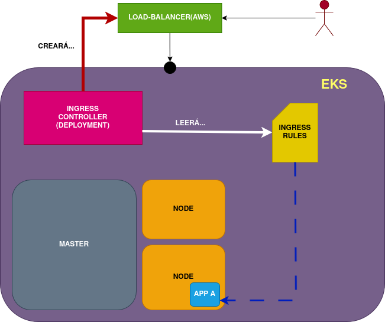

####  4.- Adición de Ingress

- Ya tenemos el cluster en EKS funcionando (máster + nodes)
- Proceso:
    -  Crearemos el IngressController como Deployment
    -  Crearemos las IngressRules
    -  El IngressController creará automáticamente (dentro de la infraestructura AWS) un Load Balancer accesible desde el exterior

Será necesario crear un ServiceAccount y un ClusterRoleBinding
    - ServiceAccount necesitará también permisos IAM para crear el LoadBalancer (ALB)

#### ALB - Amazon Load Balancer

**Subnets**:
    - En pestaña VPC, vemos que AWS creó una subred donde colocó el cluster.

Creamos ALB público:
- **Subnet publica**: Para crear los balanceadores públicos (expuestos a internet)
    - Al crear el ALB, necesitaremos la tag de la red donde está el cluster y el nombre
    - Al utilizar **eksctl**, AWS maneja automáticamente las labels
    - AWS creó varias subnets, configuramos varias subnets públicas con la tag
- **Subnet privada**: Para ALB balanceadores privados

#### Configuración de IAM

El IngressController será quien cree el balanceador de carga. Necesitamos darle permisos. Pasos:

* **1.- Enlazar un IAM OIDC (Open ID Connect) al cluster** (https://docs.aws.amazon.com/eks/latest/userguide/enable-iam-roles-for-service-accounts.html#_create_oidc_provider_eksctl)
* **2.- Crear una IAM policy** (https://docs.aws.amazon.com/eks/latest/userguide/lbc-manifest.html#lbc-iam)
* **3.- Crear un IAM role y asociarlo al Service Account** (https://docs.aws.amazon.com/eks/latest/userguide/lbc-manifest.html#lbc-iam)

Así el ServiceAccount podrá conectarse a las APIS de AWS

#### Despliegue de ALB - Amazon Load Balancer

* 1.- Instalación de Cert-Manager (https://docs.aws.amazon.com/eks/latest/userguide/lbc-manifest.html#lbc-cert).
* 2.- Instalación de IngressController y extras (https://docs.aws.amazon.com/eks/latest/userguide/lbc-manifest.html#lbc-install).

#### Despliegue app de prueba

- https://docs.aws.amazon.com/eks/latest/userguide/alb-ingress.html#application-load-balancer-sample-application

