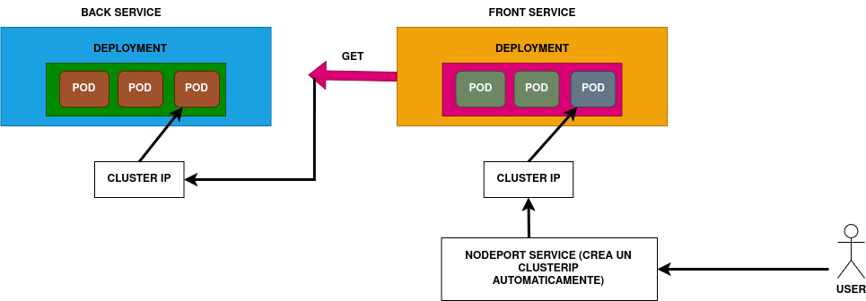

## App simple backend-frontend

#### Diseño de la app

## Proceso backend

* Creamos server en main.go

##### Prueba del container de back

* Navegamos a folder del proyecto k8s-hands-on/backend/src
* Init container con *docker run --rm -dti -v $PWD/:/go --net host --name golang golang bash*
    - dti permitirá container de fondo daemon
    - v para fijar folder compartida (volume) para editar el source del server (main.go, en el dir actual) y que sea accesible por el container haciendo refresh a
    /go inside the container
    - --net para no acceso desde fuera
    - nombre golang
    - image golang
    - ejecutamos bash sobre él
* Ejecutamos docker exec -it [id] bash para entrar en container
* Ejecutamos en container go run main.go. Verificamos que se activa server en 9090

#### Creación de Dockerfile

* Creamos image (**docker build -t k8s-hands-on -f Dockerfile .**). Le damos nombre
* Ejecutamos container (**docker run -d -p 9091:9090 --name k8s-hands-on k8s-hands-on**) y probamos app de backend (hostname es id de container)
* Eliminamos container (**docker rm -fv k8s-hands-on**)
