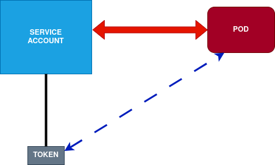

## ServiceAccounts

### API Tokens asociados a ServiceAccount

Al crear una ServiceAccount y asociarla con un pod, se crea un APItoken (manejado como un Secret) asociado al pod como volume.

Pasos a ejecutar:

- **1.** Creación de Namespace (ojo que trabajaremos en Namespace por default)
- **2.** Creación de ServiceAccount (sa.yaml)
- **3.** Creación de pod vinculado al ServiceAccount (pod.yaml)
- **4.** Utilización del Token desde dentro del pod

#### Creación de ServiceAccount

- Creamos un nuevo ServiceAccount (**kubectl create serviceaccount serviceaccounttest**).
- Revisamos en **kubectl get sa** (hay dos) y **kubectl get serviceaccounts/serviceaccounttest -o yaml**
    - Si deseamos, podemos crear ServiceAccount con manifest (**kubectl apply -f sa.yaml**). Posible crearlo en namespace por default
- El ServiceAccount **no** tiene asociado ningún token automáticamente (desde v1.31)

#### Creación de Pod y utilización del token

- Consultamos IP del cluster (**kubectl get svc**)
- Creamos el pod **kubectl apply -f pod.yaml** (vinculado al ServiceAccount)
- Revisamos con **kubectl get pods/podtest2 -o yaml**.
- Entramos al pod (**kubectl exec -it podtest2 -- sh**). Volumen con token montado en **/var/run/secrets/kubernetes.io/serviceaccount**.
    - Vemos campos ca.crt, namespace y token
    - Revisamos token(**cat token**) y lo colocamos en una var (**TOKEN=$(cat /var/run/secrets/kubernetes.io/serviceaccount/token)**)
    - Instalamos curl (**apk add curl**)
    - Consultamos otros pods disponibles desde este pod:
        - **curl -H "Authorization: Bearer ${TOKEN}" https://kubernetes/api/v1/namespaces/default/pods --insecure** da **forbidden** (el token no tiene permisos)
    - Creamos Role & RoleBinding (**kubectl apply -f role.yaml**). Consultamos los resources que necesitamos en **kubectl api-resources**
    - Ejecutamos la consulta de otros pods: **ahora el token tiene permisos y el resultado es correcto**.
- Esto es de gran utilidad para crear pods que consultan estado a otros pods, monitorizan, aprovisionan infraestructura, etc

###  Creación de un token Permanente asociado a un ServiceAccount

- Tienen mayor riesgo que porque no caducan. Aplicamos **long-lived-API-token.yml** (en este caso no va asociado a ningún pod)
- Si borramos el ServiceAccount que tiene asociado el secret, k8s automaticamente borra el token
- Revisamos token en **kubectl get secret/[tokenName] -o yaml**. Son almacenados como secrets
    - **kubectl get secret/long-lived-token -o yaml** vemos el resultado:
        -  ca.crt. Certificado público
        -  namespace codificado en base64
        -  token: jwt codificado en base64
- Al ejecutar **kubectl get secrets**, vemos  el service-account-token permanente creado
- Al ejecutar **kubectl describe sa** vemos los ServiceAccount del namespace por default. El namespace serviceaccounttest creado contiene el token enlazado **long-lived-token**.

