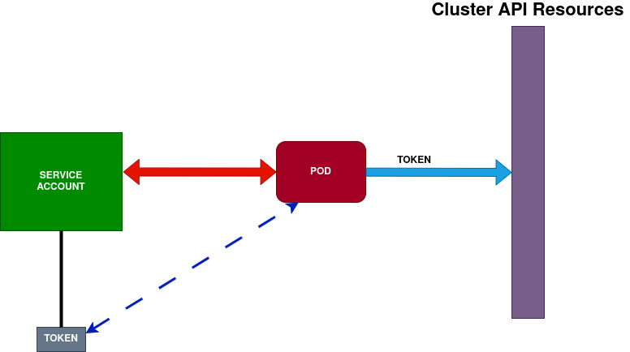

## Creación de API token asociados a ServiceAccount

Pasos a ejecutar:

- **1.** Creación de Namespace (ojo que trabajaremos en Namespace por default)
- **2.** Creación de ServiceAccount (sa.yaml)
- **3.** Creación de pod vinculado al ServiceAccount (pod.yaml)
- **4.** Creación de Token:
    - Temporal: creación de token que se anexa al pod vía cmd
    - Permanente: creación de Token de k8s que se vincula al ServiceAccount completo (el pod ya está vinculado a éste)

### Creación de ServiceAccount

- Creamos un nuevo ServiceAccount (**kubectl create serviceaccount serviceaccounttest**).
- Revisamos en **kubectl get sa** (hay dos) y **kubectl get serviceaccounts/serviceaccounttest -o yaml**
    - Si deseamos, podemos crear ServiceAccount con manifest (**kubectl apply -f sa.yaml**). Posible crearlo en namespace por default
- El ServiceAccount **no** tendrá asociado el token automáticamente (desde v1.31)

### Token Temporal (preferible) para autenticación

- Creamos pod (**kubectl apply -f pod.yaml**) vinculado al ServiceAccount con **pod.yaml**. Usaremos el output (podemos usarlo para acceso a la API, contiene flag --duration si deseamos, o si no **será eliminado cuando el ServiceAccount sea borrado**)
    - Por defecto, los pods son creados enlazados a un ServiceAccount (default si no hay ninguno).
- Creamos token enlazándolo al pod (**kubectl create token serviceaccounttest --bound-object-kind="Pod" --bound-object-name="podtest2"**). No se puede hacer con manifest.

**Pruebas** sobre el token (usando objeto TokenReview):
- Copiamos el output de la instrucción **kubectl create token** y lo colocamos en token-review.yml
- Ejecutamos **kubectl create -o yaml -f token-review.yml**
- El JWT resultante podemos decodificarlo, etc

###  Token Permanente

- Tiene mayor riesgo que el temporal (no caduca). Aplicamos **long-lived-API-token.yml** (en este caso no va asociado a ningún pod)
- Si borramos el ServiceAccount que tiene asociado el secret, k8s automaticamente borra el token
- Revisamos token en **kubectl get secret/[tokenName] -o yaml**. Son almacenados como secrets
    - **kubectl get secret/long-lived-token -o yaml** vemos el resultado:
        -  ca.crt. Certificado público
        -  namespace codificado en base64
        -  token: jwt codificado en base64
- Al ejecutar **kubectl get secrets**, vemos  el service-account-token permanente creado
- Al ejecutar **kubectl describe sa** vemos los ServiceAccount del namespace por default. El namespace serviceaccounttest creado contiene el token enlazado **long-lived-token**.

